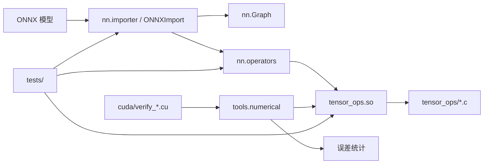

<!--
/**
  ******************************************************************************
  * @file        architecture.md
  * @author      Egor Izmaylov
  * @brief       说明工程主要模块、运行链路和重构后的代码边界。
  * @details     2026.06.02  V1.0.0  创建
  ******************************************************************************
  * @attention
  ******************************************************************************
*/
-->

# 工程架构说明

本工程围绕 ONNX 模型导入、内部图构建、Python 算子抽象、C 后端执行和 CUDA 参考验证组织。核心目标是让 Python 负责图和元数据，C/CUDA 负责可验证的数值计算。

## 模块关系

## Python 导入层

`nn/ONNXImport.py` 是兼容入口，只暴露旧的 `ONNXImport` 和 `GenericNode`。实际实现位于 `nn/importer/`：

- `core.py`：负责加载模型、运行 shape inference、构建 dtype map、解析 initializer，并按节点顺序调用注册表。
- `context.py`：保存导入共享状态，例如 dtype 查询、strict 标志和 GenericNode 记录。
- `registry.py`：维护 `OP_FACTORY_REGISTRY` 和注册函数。
- `node_factories_*.py`：按块注册 ONNX 节点工厂，负责把属性解析为内部算子对象。

## Python 算子层

`nn/Operators.py` 保留旧导入路径，只 re-export `nn/operators/` 包中的类和工具。`nn/operators/common.py` 保存 dtype、shape、采样、图执行等共享辅助逻辑，其余模块按算子职责拆分。

## C 后端

`tensor_ops/tensor_ops.h` 是公共 ABI，不应随意改动函数签名。内部实现拆分为：

- `tensor_ops_internal.h`：共享 dtype 转换、Tensor 读写、坐标、归约和宏模板。
- `tensor_ops_core.c`：Tensor 创建和释放。
- `tensor_ops_elementwise.c`：逐元素、比较、逻辑和激活。
- `tensor_ops_conv_pool_roi.c`：卷积、池化和 ROI。
- `tensor_ops_matrix_quant.c`：矩阵和量化。
- `tensor_ops_shape_index.c`：shape、索引、scatter/gather 和布局变换。
- `tensor_ops_reduce_arg.c`：归约和 Arg。
- `tensor_ops_spectral_recurrent.c`：谱算子、窗口函数和循环网络。
- `tensor_ops_normalization_loss_random.c`：归一化、损失、随机和采样。

## 验证链路

`tools/cli.py numerical` 是数值验证入口，实际逻辑位于 `tools/numerical/`。该包负责生成随机输入、调用 CUDA verifier、运行 C 后端、比较误差，并输出统计信息。模型生成、图验证和 CUDA 编译也统一由 `tools/cli.py` 的子命令调度。

`tests/` 已按算子域拆分。共享测试导入集中在 `operator_test_context.py`，后端屏蔽辅助函数在 `conftest.py`。
